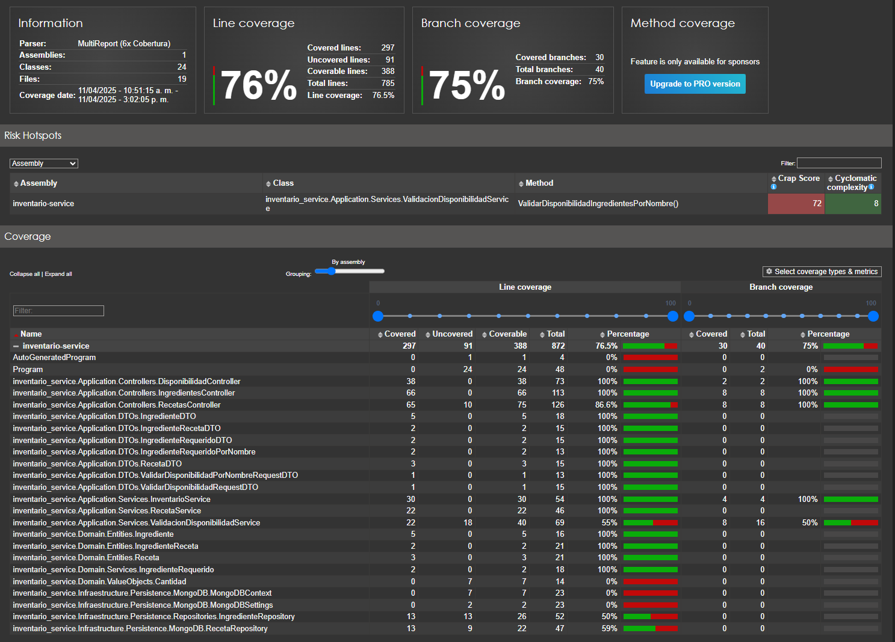

# Hola profe,

Este es nuestro trabajo de la  entrega del micro servicio de inventario. 

Tecnologías utilizadas: .net core 8 (C#) y Mongo Atlas. la db la tenemos full expuesta  0.0.0.0/0 \:v para que realice las pruebas respectivas.


## Cómo Ejecutar el Proyecto localmente

1. **Clonar este repositorio**
    ```sh
   git clone https://github.com/DevJerm/Microservicio-inventario.git
   ```

2. **ir o pararse en la ruta donde se encuentra en docker-compose.yml**
    ```sh
   cd ruta/docker-compose.yml
   ```
    
3. **Construir la imagen Docker desde el docker compose**

   ```sh
   docker-compose build
   ```
   
4. **Inicia los contenedores construidos en el paso anterior**

   ```sh
   docker-compose up
   ```

   **¡¡Importante!!** : Este despliegue esta preparado para salir por el puerto 8080 desde el contenedor. Si se desea modificar el puerto, se debe cambiar el docker-compose.yml y colocar el puerto deseado, y tambien en el program.cs
   
   builder.WebHost.ConfigureKestrel(serverOptions =>
   {
       serverOptions.ListenAnyIP(8080); <--- Colocar el puerto deseado
   });

El puerto local lo puede cambiar sin problema
[puerto_local]:[puerto_contenedor]

6. **Acceder a la API**

   - ahora la API esta disponible en: `http://localhost:8081`
   - La documentación Swagger esta disponible en: `http://localhost:8081/swagger`

## algunas pruebas a los Endpoints

### GET

- validar disponibilidad /api/Disponibilidad/validar :
   ```sh
     {
    "ingredientes": [
      {
        "ingredienteId": "67eaf409b964ba814d89193d",
        "cantidadRequerida": 5
      }
    ]
  }
   ```
   Response: True
  
- Obtener todos los ingrediente /api/Ingredientes
  Response: Lista de todos los ingredientes 
- Obtener recestas /api/Recetas
  Response: Lista de todas las recetas

Todos los endpoints  están documentados en Swagger, para su revisión y pruebas 

http://localhost:8081/swagger/index.html

Evidencias del coverage 



cualquier novedad quedamos super atentos y nos puede escribir via TEAMS, 

Saludos!!

John Estiven Restrepo Marin 

Carlos Alejandro Zuluaga Lopez

Juan Andres Loaiza Acosta
